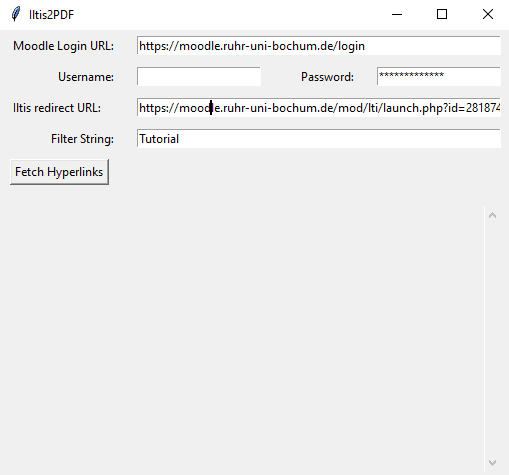
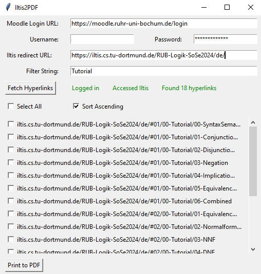
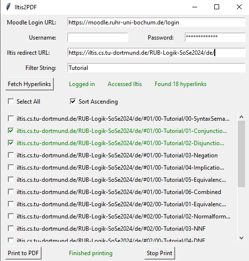

# Iltis2PDF

Simple solution for the fastest way to download the lectures on Iltis on PDF

## How-To

1. run 'main.py'
2. Type in the necesasary stuff
    - Moodle Login UR
    - Your Moodle Credentials
    - Iltis Redirect URL
      - You need to get the redirect link to the Iltis page from moodle since Iltis only works with moodle
    - Filter String       
After accessing Iltis, the redirect Url will be changed in the UI but not the code 
3. Select the Iltis pages you want to have as PDF and click Print  
    - You will have to select a Folder to download
    - 